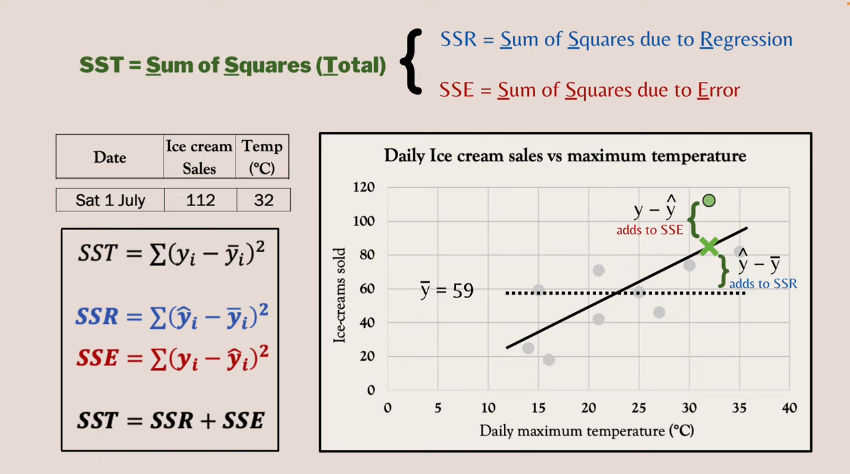

- [Linear Regression](#linear-regression)
  - [Simple Linear Regression](#simple-linear-regression)
    - [SST, SSR, SSE](#sst-ssr-sse)
    - [R-squared](#r-squared)
    - [Standard Error of the Estimate](#standard-error-of-the-estimate)
  - [Multiple Linear Regression](#multiple-linear-regression)
  - [Degrees of Freedom and Adjusted R-squared](#degrees-of-freedom-and-adjusted-r-squared)

`Resources:`
- [Linear Regression by zedstatistics](https://www.youtube.com/watch?v=eYTumjgE2IY&t=176s)
- [Linear Regression by StatQuest](https://www.youtube.com/watch?v=nk2CQITm_eo)

# Linear Regression

Linear regression is an approach for modeling the relationship between a scalar dependent variable y and one or more explanatory variables (or independent variables) denoted X. The case of one explanatory variable is called simple linear regression. For more than one explanatory variable, the process is called multiple linear regression. (This term should be distinguished from multivariate linear regression, where multiple correlated dependent variables are predicted, rather than a single scalar variable.)

It is a means of exploring the variation in some quantity (dependent variable) in relation to others (independent variables). A major objective of linear regression is to separate the variation of the dependent variable into "explained" (by the independent variables) and "unexplained" components. 

## Simple Linear Regression
In simple linear regression we fit a line through a set of points for one independent variable $x$ and one dependent variable $y$ in a 2D plane. 

The population regression line equation is given as, 
$$y_i = \beta_0 + \beta_1 x_i + \epsilon_i$$ 

Where: 
- $\beta_0$ is the intercept on the $y$ axis
- $\beta_1$ is the slope of the line
- $\epsilon_i$ is the error term for the $i^{th}$ observation

The $\beta_0 + \beta_1 x_i$ part of the equation is the **explained/deterministic** part of the model (i.e, not subjected to random chance). The $\epsilon_i$ part is the **unexplained/stochastic** part of the model (i.e, subject to randomness or at the very least not explained by the independent variable).

**`Note:`** We can never know the exact value of $\beta_0$ and $\beta_1$ for the population. We can only estimate them from the sample data.

The sample regression line equation is given as,
$$\hat{y_i} = b_0 + b_1 x_i + e_i$$

Where:
- $\hat{y_i}$ is the predicted/estimated value of $y_i$ for the $i^{th}$ observation
- $b_0$ is the intercept on the $y$ axis
- $b_1$ is the slope of the line
- $e_i$ is the error term for the $i^{th}$ observation which is a measure of the difference between the actual value and the predicted value (i.e, distance from the expected line of best fit to the actual data point). 
 
To create the line of best fit we minimize the $\sum e_i^2$ also known as the **sum of squared errors (SSE)**. This is also known as the **ordinary least squares (OLS)** method.

`Remember` that the sample regression line is our best estimate of the population regression line. So based on the sample data we take the sample regression line can vary from one another (and also the population regression line).

### SST, SSR, SSE
The total variation in $y$ is given by the **total sum of squares (SST)**,
$$SST = \sum (y_i - \bar{y})^2$$

Where: 
- $y_i$ is the $i^{th}$ observation of $y$
- $\bar{y}$ is the mean of $y$

The variation in $y$ explained by the regression line is given by the **regression sum of squares (SSR)**,
$$SSR = \sum (\hat{y_i} - \bar{y})^2$$

Where:
- $\hat{y_i}$ is the predicted/estimated value of $y_i$ for the $i^{th}$ observation (lies on the line of best fit)
- $\bar{y}$ is the mean of $y$

The variation in $y$ not explained by the regression line is given by the **error sum of squares (SSE)**,
$$SSE = \sum (y_i - \hat{y_i})^2$$

Where:
- $y_i$ is the $i^{th}$ observation of $y$
- $\hat{y_i}$ is the predicted/estimated value of $y_i$ for the $i^{th}$ observation (lies on the line of best fit)

### R-squared
The **coefficient of determination** or **R-squared** is the proportion of the variation in $y$ explained by the regression line (i.e, the variation in the independent variables $X$). It is given by,
$$R^2 = \frac{SSR}{SST} = 1 - \frac{SSE}{SST}$$

Where:
- $SSR$ is the regression sum of squares
- $SSE$ is the error sum of squares
- $SST$ is the total sum of squares

The value of $R^2$ is between 0 and 1. The closer it is to 1 the better the model fits the data.

### Standard Error of the Estimate
The **standard error of the estimate** is a measure of the accuracy of predictions made with a regression line. It is given by,
$$s_e = \sqrt{\frac{SSE}{n-2}}$$

Where:  
- $SSE$ is the error sum of squares and is given as, $SSE = \sum (y_i - \hat{y_i})^2$
- $n$ is the number of observations in the sample

## Multiple Linear Regression
In multiple linear regression we try to model the relationship between a scalar dependent variable $y$ and two or more explanatory variables $X_1, X_2, ..., X_n$ in a $n$-dimensional space.

The population regression line equation is given as,
$$y_i = \beta_0 + \beta_1 x_{i1} + \beta_2 x_{i2} + ... + \beta_n x_{in} + \epsilon_i$$

And the sample regression line equation is given as,
$$\hat{y_i} = b_0 + b_1 x_{i1} + b_2 x_{i2} + ... + b_n x_{in} + e_i$$

In the case of 2 independent variables and 1 dependent variable we can visualize the model as a plane in a 3D space. But more than that we cannot visualize and instead we have to rely on the mathematical equations. 

*SST, SSR, SSE, R-squared, Standard error of the estimate* all are calculated in the same way as in simple linear regression since they only depend on different measures of the variable $y$ ($y_i$, $\bar{y}$ and $\hat{y_i}$).

## Degrees of Freedom and Adjusted R-squared
To find the degrees of freedom we need to ask ourselves how many independent pieces of information do we have to estimate the population parameters.

Let's consider the simple linear regression case. How many data points do we need to fit a regression model? The first intuition is that we need 2 data points to fit a line. So we need at least 2 data points to fit a liner regression model. Right? No, this is not the case. With only 2 observations, true we can draw a line through them but there will be no errors. A regression model needs the possibility of error. So, we need at least 3 data points to fit a simple linear regression model. So we would have (3-2) = 1 degree of freedom (if we only have 3 sample data points).

If we consider a multiple linear regression model with 2 independent variables then we would need at least 4 data points to fit the model (since with 3 data points you would be able to fit a plane through them but have no errors). So we would have (4-3) = 1 degree of freedom (if we only have 4 sample data points).

The general formula for degrees of freedom is given as,
$$df = n - k - 1$$

Where:
- $df$ is the degrees of freedom
- $n$ is the number of observations in the sample
- $k$ is the number of independent variables in the model

So we can see a pattern here. With a fixed number of sample observations, the more independent variables are added to the model the less degrees of freedom we have. This have a serious implication. As the degrees of freedom decreases, the opportunity/ability of the model to correctly identify the error (i.e, the measure of unexplained variation/randomness in the model) decreases. As a result we can add unrelated independent variables to the model and the model can still fit the data well. So we can fool ourselves into thinking that our model is performing better while in reality the model is just losing its ability to represent the error.

To account for this behavior we use the **adjusted R-squared** to evaluate how well the model fits the data (actually).

The **adjusted R-squared** is given as,
$$R^2_{adj} = 1 - [(1-R^2)(\frac{n-1}{n-k-1})]$$
